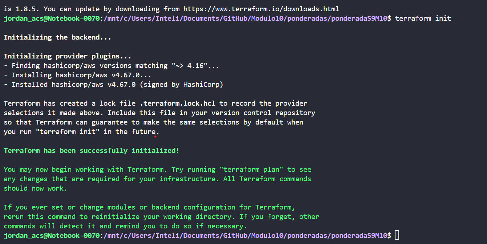
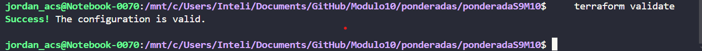
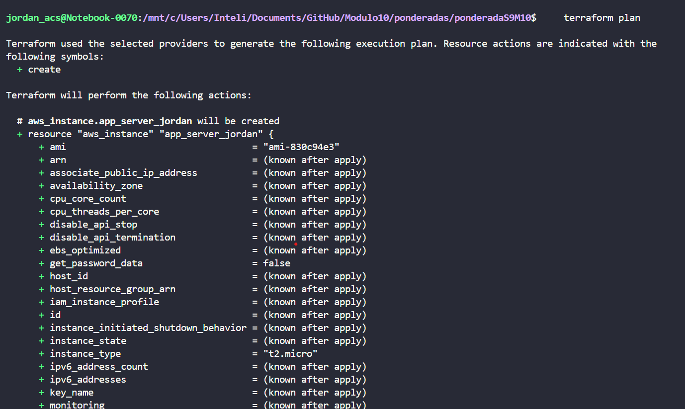
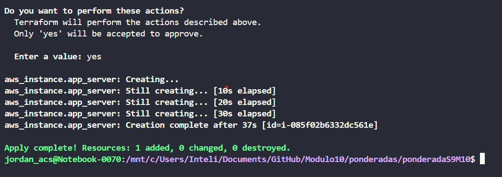
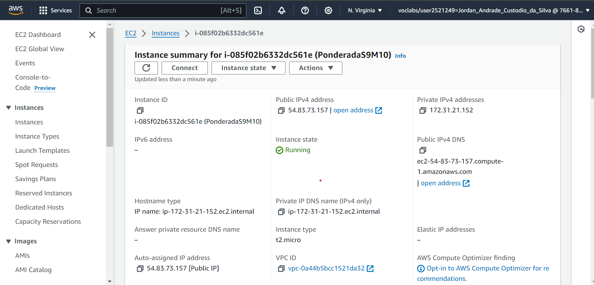

# Ponderada de Programação S9M10

## O que é o Terraform?

Terraform é uma ferramenta de infraestrutura como código (IaC) desenvolvida pela HashiCorp. Ela permite que os usuários definam e provisionem infraestruturas de TI utilizando uma linguagem de configuração declarativa. O Terraform é capaz de gerenciar ambientes de computação em nuvem, servidores físicos, contêineres, e outros recursos, tornando-o uma solução versátil para a automação da infraestrutura.

## Importância do Terraform

1. **Automação Completa**: O Terraform permite a automação completa do ciclo de vida da infraestrutura, desde o provisionamento inicial até as atualizações e desativação de recursos. Isso reduz a necessidade de intervenção manual, minimizando erros humanos e aumentando a eficiência.

2. **Consistência e Reprodutibilidade**: Utilizando uma linguagem de configuração declarativa, o Terraform assegura que a infraestrutura seja provisionada de forma consistente, independentemente de quem está executando o código ou onde ele está sendo executado. Isso facilita a reprodutibilidade e a colaboração entre equipes.

3. **Infraestrutura como Código (IaC)**: Com o Terraform, a infraestrutura é tratada como código, o que significa que pode ser versionada, testada e revisada da mesma forma que o software tradicional. Isso traz as melhores práticas de desenvolvimento de software para a gestão de infraestruturas.

4. **Multicloud e Multi-Provider**: O Terraform suporta diversos provedores de serviços de nuvem, como AWS, Azure, Google Cloud, além de outros provedores de infraestrutura. Isso permite uma gestão unificada de diferentes ambientes, facilitando a migração e a integração de serviços.

## Vantagens do Terraform


1. **Escalabilidade**: O Terraform facilita a escalabilidade da infraestrutura, permitindo que os recursos sejam rapidamente provisionados e configurados conforme necessário.

2. **Eficiência Operacional**: A capacidade de automatizar e gerenciar a infraestrutura de maneira eficiente resulta em economias de tempo e custo. As equipes de TI podem se concentrar em tarefas estratégicas em vez de gerenciar manualmente a infraestrutura.

3. **Comunidade e Suporte**: O Terraform possui uma comunidade ativa e uma ampla gama de provedores e módulos disponíveis. A documentação extensiva e os tutoriais ajudam a acelerar a curva de aprendizado e a resolver problemas rapidamente.

4. **Segurança e Compliance**: Com a infraestrutura definida como código, é mais fácil garantir que todas as políticas de segurança e compliance sejam aplicadas de forma consistente em todos os ambientes. As revisões de código e os testes automatizados ajudam a identificar e corrigir problemas antes que eles se tornem críticos.

## Criação de uma EC2 por meio do Terraforms 

### Configuração de ambiente:

* Primeiramente, é necessário instalar a CLI da AWS seguindo os passos do [guia de instalação oficial](https://docs.aws.amazon.com/pt_br/cli/latest/userguide/getting-started-install.html). Essa ferramenta será responsável por estabelecer a comunicação da sua máquina local com a infraestrutura da AWS.
* Após a instalação, configure suas variáveis de ambiente seguindo utilizando o seguinte comando: 

```
aws configure
```
* Este comando irá inciar um terminal interativo que solicitará todas as informações necessárias para a configuração das credenciais de acesso à AWS.

>Observação: Caso esteja utilizando um ambiente AWS Academy, uma credencial a mais chamada 'session token' deverá ser configurada da seguinte maneira: `aws configure set aws_session_token <your_session_token>`

* Em seguida, instale o Terraform seguindo o [guia de instalação oficial](https://developer.hashicorp.com/terraform/tutorials/aws-get-started/install-cli). O Terraform é a ferramenta que permitirá a definição e o provisionamento da infraestrutura de forma automatizada.

### Aplicando o Terraforms em um projeto
* Após a instalação das ferramentas, crie um arquivo chamado "main.tf" no diretório de sua escolha. Este arquivo conterá a configuração da sua infraestrutura. Aqui está um exemplo básico de como esse arquivo pode ser estruturado:

```
terraform {
  required_providers {
    aws = {
      source  = "hashicorp/aws"
      version = "~> 4.16"
    }
  }

  required_version = ">= 1.2.0"
}

provider "aws" {
  region = "us-east-1"
}

resource "aws_instance" "app_server" {
  ami           = "ami-0c02fb55956c7d316"
  instance_type = "t2.micro"

  tags = {
    Name = "PonderadaS9M10"
  }
}
```

* Após a construção do arquivo, execute o seguinte comando no terminal para inciar o diretório de trabalho no terraforms:`
```
terraform init
```


* Em seguida, execute o seguinte comando para validar o código criado:
```
terraform validate
```


* Em seguida, execute o seguinte comando para criar um plano de execução do terraforms:

```
terraform plan
```


* Por fim, execute o último comando para criar a EC2 na AWS:
```
terraform apply
```


### Evidência de criação


